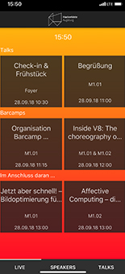

# **Readme_Hackerkiste18**
## Cross-Platform-Entwicklung von 0 auf 100

Beschreibung
Die Hackerkiste ist schon wieder vorbei und auch dieses Jahr waren wir dabei.:smile:

Unser Team aus Designern, Front- und Backendentwicklern erarbeiteten in zwei Tagen einen Prototypen. 
Mit dem Ziel auch bei der Hackerkiste die Digitalisierung 4.0 voranzutreiben entstand die **Hackerkisten-App**.
Eine App, die bei der gesamte Planung und Orientierung für jeden eine individuelle Hilfestellung geben soll.

Das Designerteam entwarf ein Konzept mit mehreren Screens, die durch Swipen gewechselt werden.

Beim Starten der App wird immer die zweite Seite, mit Uhrzeit und allen aktuellen Events, angezeigt. **Screenshot**

Durch Rechtsswipen gelangt man auf eine vollständige Liste aller Talks und Barcamps.

Um die App individuell für sich zu nutzen sollte es ermöglicht werden, durch doppeltes Anklicken spezifische Events zu makieren. **Screenshot**

Die Auswahl wird dann in einem personenabhängigen Terminplaner angezeigt (vierte Seite).       **Screenshot**

Damit soll der Nutzer die Möglichkeit erhalten, einen eigenen Eventplan zu erstellen. 

Umgesetzt wurde das Konzept von unseren Cross-Platform-Entwicklern.
**Schreenshot**

Leider konnten wir nicht alle Ideen aufgrund des Zeitmangels verwirklichen.
Weitere Features wie
- eine Kurzbenachrichtigung bevor das nächste Event startet
- die Navigation zum und vor Ort 
- die Ampel-Anzeige, (die Auskunft darüber gibt, wie gut ein Event besucht sein wird)
und viele mehr möchten wir deshalb im folgenden Jahr ergänzen. 

Verwendung - wie wird das projekt nach der Installation verwendet/ Screenshots
:+1:
